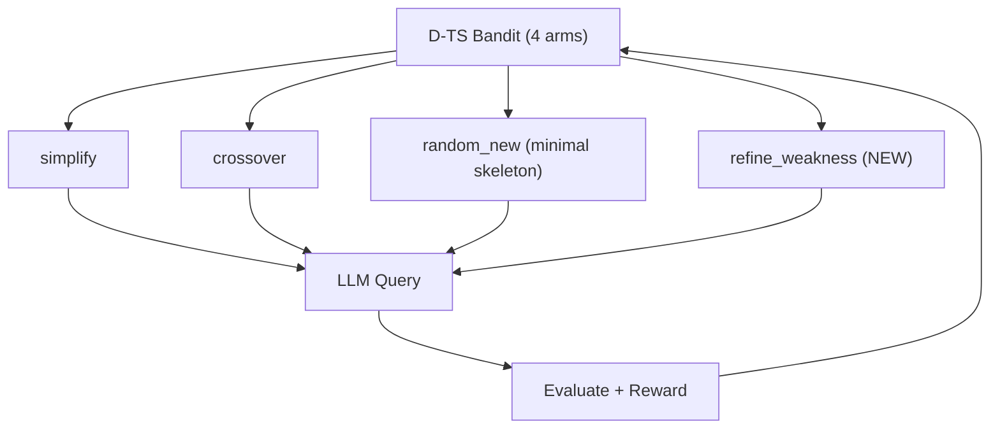

# GA-LLAMEA: refine_weakness Arm + random_new Skeleton Modification

## Diagnosis

Every top solution across all runs is a DE variant. The population becomes a DE monoculture early because:

- `random_new` shows the best solution's full code as "structural reference," biasing the LLM to produce similar algorithms
- `simplify` and `crossover` only see a single aggregate fitness number, so the LLM cannot reason about where the algorithm actually fails

---

## Change 1: New `refine_weakness` Arm

**File**: `operators.py`

Add a new `WeaknessRefinementOperator(BaseOperator)` class with `name = "refine_weakness"`.

**What it does**: Shows the parent algorithm's code alongside its **per-instance AOCC scores** (already stored in `metadata["aucs"]`), sorted worst-to-best, with weak instances labeled. Asks the LLM to analyze what optimization landscapes cause failures and redesign for robustness.

**Prompt structure**:

```
{task_prompt + example}

{population_history}

Algorithm to improve (mean AOCC: {parent.fitness:.4f}):
```python
{parent.code}
```

Per-instance performance (AOCC scores, sorted worst to best):
- Instance 0: 0.5216 (WEAK)
- Instance 17: 0.5370 (WEAK)
- ...
- Instance 11: 0.9951 (STRONG)

This algorithm performs well on average but poorly on some problem instances.
Analyze what types of optimization landscapes or function properties might
cause these failures. Redesign the algorithm to be more robust across all
instances while maintaining its strengths on the ones it already handles well.

{format_prompt}
```

**Baseline for reward**: Parent fitness (same as simplify).

**Key detail**: The parent's `metadata["aucs"]` is a list of 20 floats (one per training instance). Sort them, label bottom quartile as WEAK, top quartile as STRONG.

---

## Change 2: Modify `random_new` to Use Minimal Skeleton

**File**: `operators.py`

**Current behavior** (lines 331-341): Shows the best solution's full working code as structural reference. This biases the LLM toward the same algorithm family (always DE).

**New behavior**: Replace the full code reference with a minimal structural skeleton:

```python
# Replace lines 336-341 in RandomNewOperator.build_prompt():
reference = """
For correct code structure, follow this template:
```python
import numpy as np

class YourAlgorithm:
    def __init__(self, budget=10000, dim=10):
        self.budget = budget
        self.dim = dim

    def __call__(self, func):
        lb = func.bounds.lb  # lower bounds (numpy array)
        ub = func.bounds.ub  # upper bounds (numpy array)
        f_opt = np.inf
        x_opt = None
        eval_count = 0

        # Your optimization logic here
        # Use func(x) to evaluate a candidate x (numpy array of shape (dim,))
        # Track eval_count and stop when eval_count >= self.budget

        return f_opt, x_opt
```
Use a DIFFERENT strategy from the algorithms listed above. This template is only for correct structure and formatting.
"""
```

This gives enough structural information to prevent `__call__` signature errors and return-type mismatches, without revealing any algorithmic strategy.

---

## Change 3: Register in core.py

**File**: `core.py`

1. **Import** `WeaknessRefinementOperator` (line 64)
2. **Add to bandit** arm_names (line 190): `["simplify", "crossover", "random_new", "refine_weakness"]`
3. **Instantiate** operator (after line 200): `self._refine_weakness = WeaknessRefinementOperator()`
4. **Add routing** in `_generate_offspring` (after line 345, before the `else` for random_new):

```python
elif operator_name == "refine_weakness":
    parent = self._select_parent()
    prompt = self._refine_weakness.build_prompt(
        problem, self.population, parent
    )
    parent_ids = [parent.id]
    baseline_fitness = parent.fitness
```

The AUC data flows automatically: the parent's `metadata["aucs"]` is already populated from previous evaluation. The operator reads it in `build_prompt()` via `parent.metadata.get("aucs", [])`.

---

## Architecture After Changes



No changes needed to `bandit.py` (already supports arbitrary arm count) or `utils.py` (reward system works as-is).

---

## Implementation Checklist

- [x] Implement `WeaknessRefinementOperator` in `operators.py` (shows parent code + per-instance AUC scores, asks LLM to diagnose failures and redesign for robustness)
- [x] Modify `RandomNewOperator` in `operators.py` (replace full best-solution code reference with minimal structural skeleton)
- [x] Update `OPERATORS` dict and `get_operator()` in `operators.py` to include the new operator
- [x] Update `core.py`: add `refine_weakness` to bandit `arm_names`, instantiate `WeaknessRefinementOperator`, add routing logic in `_generate_offspring`
